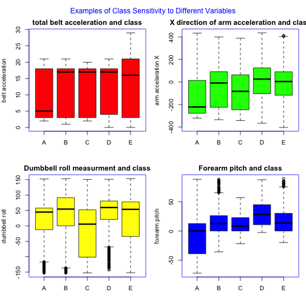

# Practical Machine Learning - Excercise Project
## Problem Statement
### The data
The data set is from accelerometers placed on the belt, forearm, arm and dumbell of 6 male participants ages 20-28.  These 6 people were given a fairly light dumbbell (1.25 Kg) and then asked to lift it both correctly and with 4 common excercise mistakes.  
1. Excercise performed exactly according to specification (Class A)
2. Elbows were thrown toward the front of the body during the lift (Class B)
3. Dumbbell is lifted only half way (Class C)
4. Dumbbell is lowered only half way (Class D)
5. The persons hips were thrown to the fron during the lift (Class E)

The data for this project come from this source: http://groupware.les.inf.puc-rio.br/har, which is the Human Activity Recognition website.  The data was presorted into a training data set, for which answers were in the last column under the name of "classe", and a testing set which did not have the answers, but rather ended with an id number for submission elsewhere.  For this reason the training and tested described in this document all resulted from this test set which is loaded with the following R code:


```r
data<-read.csv("http://d396qusza40orc.cloudfront.net/predmachlearn/pml-training.csv")
```
### The Goal
The goal of this work is to predict the manner in which the excercise was done, given the information from each of the sensors as represented in the data set.  For example, if in a subsequent excercise event the participant only lifted the dumbbell half way, the predictor should return "C".

While it is not expected that a machine learning algorithm will be a perfect predictor, higher accuracy is better.  On the HAR website they had an example matrix indicating 74% to 86% accuracy for correctly predicting the "classe".  This will serve as a benchmark for an acceptable prediction algorithm. 

## Exploratory Data Analysis
The data set has 19622 rows and 160 columns of results from the output of the sensors, combined with columns representing processed results like maximum, minimum and average values.  Each participant had around 3000 entries into this data set, and each of the excercise types were fairly uniformly represented.  

Closer inspection revealed that about 2/3 of the data features were over 97% blank or NA. These features were removed from the data set.  It was also noted that the date remaining varied a great deal in absolute manitude, and so during the training part of the machining learning step the data as normalized and centered, although this did not happen until after the data was spit into a training and test set.  

Of the remaining variables, none had a particularly good separation for the different classes of excercise.  In all cases ranges of each variable overlapped significantly with other classes, although there was information in the data because absolute ranges and means varied differently from sensor reading to sensor reading. The following graphs show examples of the classes of excercise vs. 4 different variables.

 


Figure 1:  Four examples (belt,arm,dumbbell and forearm sensors), showing how the different variables added some information but individually could not be used to predict the class of the exercise (A,B,C or D)

## Building a Model
### Cross Validation
In order to prevent overfitting of the model the data set was divided into a training and testing set, with 75% of the data in the training set and 25% in the testing set.  This was done in such a way that the different classes were uniformly distributed in the two data sets.  The model building was done on the training data set and only tested on the testing set. 


### Partial Least Squares
Two types of models were used to build a predictor given this test set.  The first was a Partial Least Squares (pls) model.  This type of model can be used for classification (this problem) or regression (a continuous variable output).  It is good when one needs only a prediction and does not need to be able to understand how the features built to a result.  It is also recommended when you have a bunch of data that may not be that different from eachother.  This method samples the data and fits a linear model, and into this model an additional 3 slice repeated cross validation step was added.  The r code for the model is shown below.  Note that pre-processing to center and scale the data is part of the training call. 


```r
#### using pls
#install.packages('pls')
ctrl<-trainControl(method="repeatedcv",repeats=3)
plsFit<-train(classe~.,data=training,method="pls",tuneLength=15,trControl=ctrl,preProc=c("center","scale"))
#preObj<-preProcess(training[,-53],method=c("center","scale"))
plsClasses<-predict(plsFit,newdata=testing)
plsans=confusionMatrix(data=plsClasses,testing$classe)
plsans$table
```

```
##           Reference
## Prediction    A    B    C    D    E
##          A 3490  780  627  282  243
##          B   52 1291  144  111  433
##          C  219  424 1410  258  276
##          D  376  125  296 1530  369
##          E   48  228   90  231 1385
```
Table 1: The Confusion Matrix output for the Partial Least Squares model.  There are significant off diagonal terms.

This model did not meet the accuracy baseline target for this project, having an overall accuracy of 62%.  Features could have been created from the variables to improve that number, but instead a model that does a better job of "creating features" automatically was tested instead. 

### Least Squares Support Vector Machine
Support Vector Machines are a very popular type of machine learning algorithm.  They try to create the greatest distance in n-dimensional space between classes of objects, and those examples that are closest to the decision boundary are the most heavily weighted examples.  The command in R that creates this model has as a default normalization of the data.  The R code used and resulting Confusion Matrix for this model are given below. 

```r
### lets try a support vector machine
#install.packages('kernlab')
lssvmFit<-lssvm(classe~.,data=training)
```

```
## Using automatic sigma estimation (sigest) for RBF or laplace kernel
```

```r
svmClasses<-predict(lssvmFit,newdata=testing)
ans=confusionMatrix(data=svmClasses,testing$classe)
ans$table
```

```
##           Reference
## Prediction    A    B    C    D    E
##          A 3894  393  111   87   98
##          B   63 2092  205   84  174
##          C   61  199 2130  299  184
##          D  152   68   77 1912  193
##          E   15   96   44   30 2057
```
Table 2: The Confusion Matrix output for the Least Squares Support Vector Machine model.  This model has significantly fewer off axis terms.  

This model performed much better on the data, with an overall accuracy of 85%, slighlty better than the benchmark on the HAR website, and acceptable for this project.  This means the **out of sample error rate was 15%**.  This rate was again validated on a second set of test samples for which we did not have the result but was checked by submission.  That set also had a 15% error rate.

## Conclusion
A Least Squares Support Vector Machine predictor was built to generate a prediction as to the class of excercise given a test data set.  This model performed better than a Partial Least Square model, although the pls model could likely be optimized with improved feature generation.  
